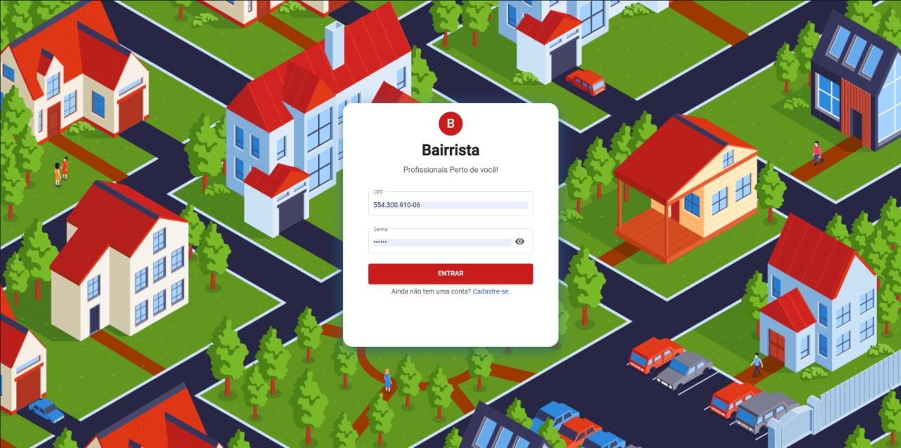
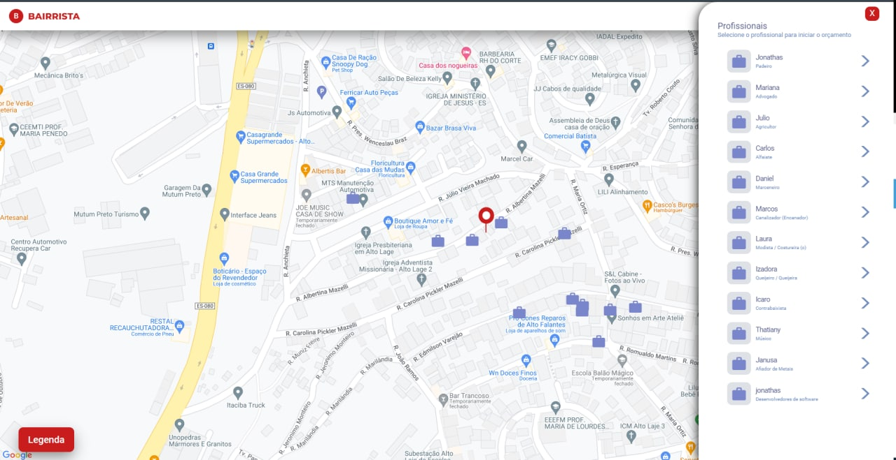
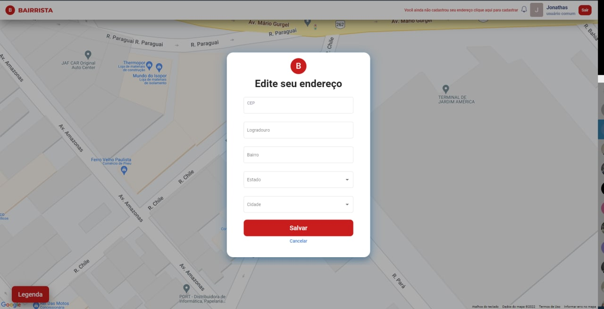

<!-- PROJECT LOGO -->
<br />
<p align="center">
  
  <h3 align="center">Bairrista </h3>

  <p align="center">
    O que foi utilizado nesse projeto?         
    <br />
    <a href="https://angular.io"><strong>Angular »</strong></a>     
  </p>
</p>

<div align="center">
 
 
  
</div>


<!-- TABLE OF CONTENTS -->
<details open="open">
  <summary>Opções</summary>
  <ol>
    <li>
      <a href="#sobre">Sobre o projeto</a> 
    </li>
    <li>
      <a href="#usar">Como usar</a>      
    </li>   
  </ol>
</details>


<!-- ABOUT THE PROJECT -->
## sobre

PONTIFÍCIA UNIVERSIDADE CATÓLICA DE MINAS GERAIS
        NÚCLEO DE EDUCAÇÃO A DISTÂNCIA -
Pós-graduação Lato Sensu em Desenvolvimento Web Full Stack
     -   Jonathas David Fiscina Assis


<!-- GETTING STARTED -->
## usar

### Pré-requisitos

* npm
  ```sh
  npm install npm@latest -g
  ```

### Installation

1. Clone o repositório 
   ```sh
   git clone https://github.com/thefiscina/bairrista-tcc-web.git
   ```
2. instale os pacotes > NPM packages
   ```sh
   npm install
   ```
3. Rode no navegador
   ```sh   
    ng serve -o;
   ```   
  
